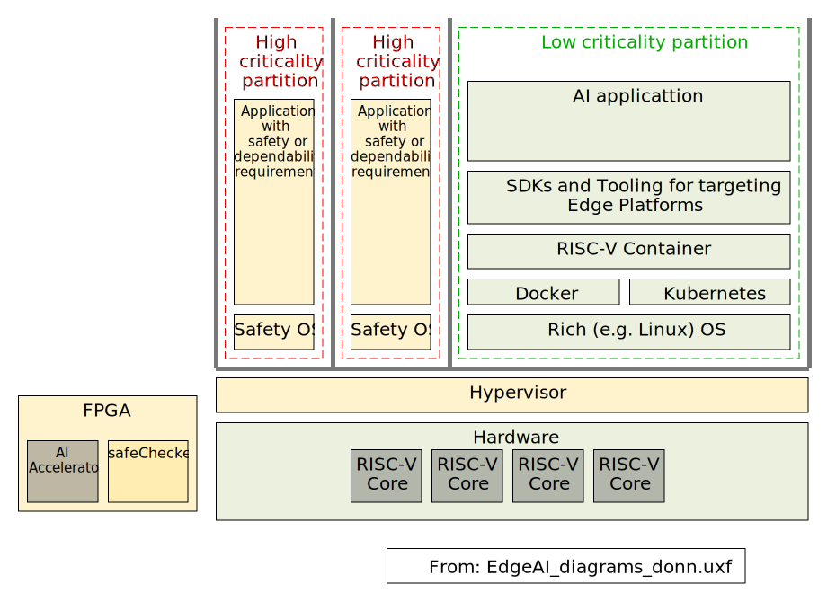
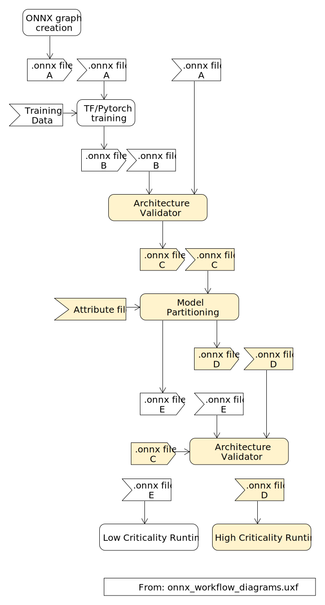
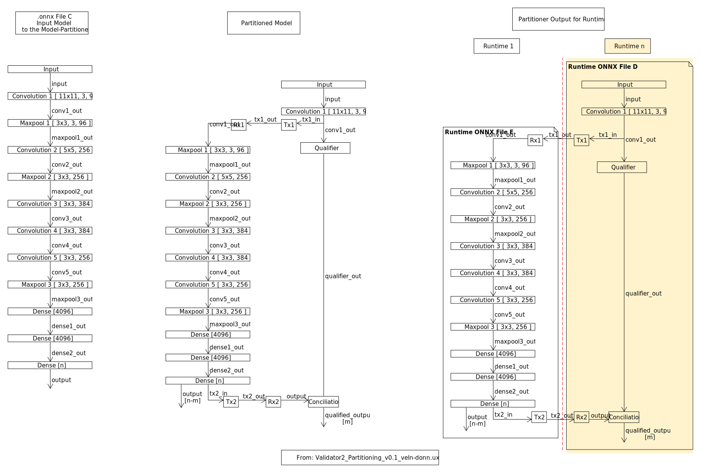

# Partitioning of AI Models for Execution on Mixed Criticality Systems. 

----

## Authors
Hans Dermot Doran & Suzana Veljanovska, High Integrity Ssstems research lab at the Institute of Embedded Systems, Zurich university of Applied Sciences. 

## Introduction

### Motivation Originating Use Case
The [REBECCA chip](https://www.rebecca-chip.eu) is envisioned as a (four-core) RISC-V device with a chiplet supporting an FPGA and further chiplets supporting a variety of AI accelerators. 
The platform is envisaged as supporting (functionally) safe and secure edge-AI applications. 
Since none of the devices (CPU, AI-accelerators) used are developed for reliable applications, redundancy is the only option to enforce reliable execution. 
The special challenge in adopting redundancy for AI inference is that the latency resulting from redundant execution of an entire model is considered too high for an embedded system, especially in an application with functional safety relevance where liveliness is paramount. 
Further latency challenges are posed by error handling - if an error in inference calculations is detected, does one activate the safety function or does one try to recover the situation, potentially repeating two inferences? 

Partitioning the execution into discrete chunks is one way of shortening the error-detection latency. 
Assigning reliable execution to an FPGA platform where total control of the mathematical backend is guaranteed, and the toolset supports a safety workflow against non-critical processing assigned to an AI-accelerator necessitates reliability-relevant partitioning of the AI model. 

The criticality-relevant "overlay" on the hardware is depicted below. 
Critical artifacts are in yellow and non-critical artifacts are in green. 

<figure>
    
    <figcaption><b>Figure 1: </b> REBECCA architecture overlaid with critical and non-critical SW.</figcaption>
</figure>

## Requirements Generation

### Operative Workflow
We begin our requirements generation based a user story as understood by very early understandings of a user story. 
The semi-formal nature of these user scenarios serves to create a common language as well as a sandbox in which it is easier to negotiate the first formal steps. 
Using this process, we generate scenarios from which we begin a discussion on process, including priorities (e.g. safety before function) and then a sequence of operative steps.

<figure>
    
    <figcaption><b>Figure 2:</b> AI for critical systems workflow.</figcaption>
</figure>

### Partitioning Workflow
The first step in the workflow is the training of the AI-algorithm to create a model. Training is a complex task and we cannot anticipate the availability of safety-qualified training tools in the near future. We therefore do not possess the basis for safety-qualification of the training process and hence the model, but we can ensure that the algorithm has remained unchanged by the training process. We therefore postulate validation of the model against the algorithm. 
The second step, the generation of a partitioned and safety-qualified model, will conclude with at least two partial model representations. At least one of these will foreseeably evidence some, yet to be defined, safety-relevant features. The precise mechanics of the partitioning process is out of scope of our body of work - it can be manual, fully automated or anything in-between. Formally speaking the output of this process nevertheless should be validated against the original model and any addi-tional safety attributes. Validation should be performed on the physical instances of the partitioned model, that is the files containing the model representations, files that are used to configure the runtimes. Our second validator is constructed for that pur-pose. 

<figure>
    
    <figcaption><b>Figure 3:</b> Model Partitioning Workflow with Validation Points</figcaption>
</figure>
From: Doran et. al. [2024 A](https://arxiv.org/abs/2410.01850)

### Partitioning
On closer observation partitioning a model may well be a generic desire rather than one closely tied to critical or mixed-criticality processing. Partitioning in a computer architecture rather than across cloud and edge device, may be declared as a generic desire. Partitioning in an embedded system includes the transfer of data across bus systems to secondary units for further processing. This implies some form of explicit or implicit synchronisation, for instance an AI accelerator may only start inference when sufficient data has been received. During such transfers, the shape of the data is expected to remain constant but data types may change, depending on the charac-teristics of the underlying execution hardware. In terms of the model representation, additional input and output paths with differently named paths are being created. In terms of model execution, the latency increases and estimation tools require some guidance so that engineering can produce deterministic results. We therefore maintain that this transfer and synchronisation must be formally accounted for in the model representation. 
The transferable chunk-size may (sensibly) vary from a kernel, through layer to entire model. An example illustrating the partitioning of a single kernel to run on a different runtime is depicted below. The transmit units (Tx) and Receive (Rx) units can be clearly identified and their position in the output files for use by the individual run-times is clearly visible. We assume that synchronisation (if any) is part of com-munication so we feel including a separate unit is not necessary. We include a con-catenator function to ensure that returning kernel data is ordered in some fashion. ONNX, in essence, merely represents functions with parameters and input and output data, of which the data transfer (Tx, Rx) and concatenator are three of many possi-ble functions. At this level of abstraction it is not considered necessary to provide more detail, apart from input shape. 

<figure>
    
    <figcaption><b>Figure 4:</b> Partitioning of an AI model.</figcaption>
</figure>

### Partitioning for Critical Systems
Partitioning for high-criticality is conceptually equal to partitioning for low-criticality systems, practical differences remain, these are
- ensuring the integrity of the model representation through the workflow
- establishing an audit trail; any specialist functions to determine the reliability of the result of inference
- ensuring the quality of the encoded functions
- ensuring that the runtimes are cognizant of the criticality level in order to ensure that critical sections of the model are only executed on critical runtimes. 

A hash or some other such security protection mechanism across the file is con-sidered sufficient to protect the integrity of the model representation throughout the work flow. Under the assumption that legacy and non-critical toolsets are under no obligation to understand directives designed for what is a niche market, the presence of a tagged audit trail is a definitive statement to runtime tooling of the status of the model representation. We propose that the audit trail consists of tags, metadata fields in the ONNX file format, clearly indicating the criticality level, the stage of the repre-sentation in the tool chain and the relationship and dependencies to any non-critical model representations.   
Our protected-channel pattern implementation (From: Doran et. al. [2024 B](https://ieeexplore.ieee.org/document/10710935)), used to qualify inference results, necessitates a qualifier function whose representation in the model can be the same as a general function. In a real-world implementation this function must be implemented according to a domain-specific functional safety standard, for instance the IEC 61508.

<figure>
    
    <figcaption><b>Figure 5:</b> Partitioning of an AI model for Execution on Mixed-Criticality Systems,</figcaption>
</figure>

----

## Proof of Concept

### Validators
The validators are designed to validate elements of the partitioning process, the first to validate the original algorithm against the trained model. 
This is intended to ensure that a non-qualified training tool does not alter the algorithm. 
The second validator is intended to demonstrate that the representations of the partitioned model do indeed correspond to the original model (trained algorithm). 
Text specifications for the two validators were created. 
A proof-of-concept was implemented, according to the V-model, in Python. 
Efforts to re-implement this in Guile - the functional ap-proach is considered attractive in terms of viability assessment - are a work-in-progress. 
Unit and interface tests were also created in Python, it is the intention to re-use these for the Guile implementation. 

### Proof of Partitioning
Validation of the validators – in other words the proof of partitioning – was achieved with a set of ONNX models created from diagrams drawn in Umlet. 
We chose this path because the precision necessary to specify validation models is not given in an ecosystem-specific tool such as the well-known ONNX visualisation tool Neutron. 
These depictions were then converted to the ONNX model representation format using a (Python) script.
To achieve final validation, we created a number of partitionable real-world (as opposed to edge-case) models, generated the runtime-files and passed them to two ONNX runtime systems for execution. 
Two Python processes were spawned and an ONNX runtime assigned to each. 
The files were read in by the runtimes and executed in the expected sequence. 
To achieve this, we had to implement the Tx and Rx functions, including with IPC and synchronisation functions. 

<figure>
    
    <figcaption><b>Figure 7:</b> Partitioning Validation,</figcaption>
</figure> 

----
